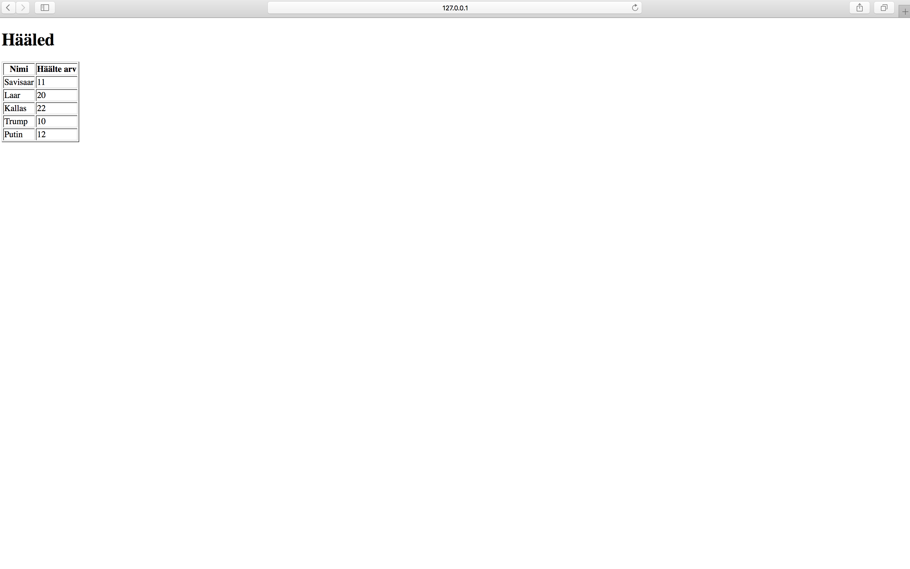
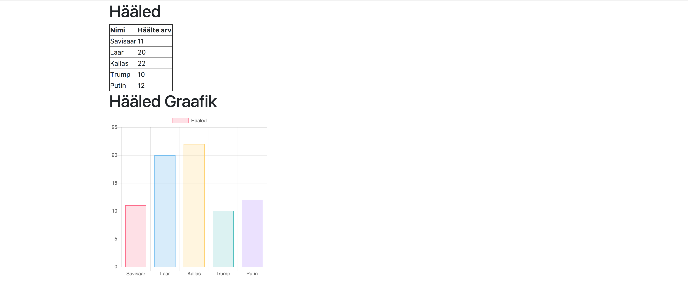

# VeebiraamistikudDjangoProject
See projekt on Veebiraamistike 15.11 Interaktiivse graafilise andmelehestiku sidumine Djangoga seminariks
1. Alustuseks laadige alla algne projekt siit https://github.com/mikksillaste/VeebiraamistikudDjangoProjectAlgus
2. Käivitage alla laetud projekt mis loob veebiserveri: python manage.py runserver
3. Minge brauseris aadressile: localhost:8000. Laetud leht peaks välja nägema selline:

4. Avage views.py ja lisage
   ```python
   # Impordi JsonResponse
   from django.http import JsonResponse
   
   # Andmete saamine JSON'i kujul
   def get_data(request):
       h22led = models.H22led.objects.all().values('inimese_nimi', 'h22lte_arv')
       return JsonResponse(list(h22led), safe=False)
   ```
5. Avage interaktiivneGraafika/urls.py lisage endpoint views.get_data
   ```python
   urlpatterns = [
       url(r'^$', views.index, name='index'),
       # Lisa endpoint
       url(r'^api/data$', views.get_data, name='api-data'),
   ]
   ```
6. Minge brauseris aadressile: localhost:8000/api/data. Laetud lehel peaks olema andmed JSON'i kujul
7. Loo templates kataloogi js.html fail ja lisa sinna järgmised asjad:
   ```html
   <!-- jQuery (necessary for Bootstrap's JavaScript plugins) -->
    <script src="https://ajax.googleapis.com/ajax/libs/jquery/1.12.4/jquery.min.js"></script>

    <!-- Bootstrap -->
    <script src="https://maxcdn.bootstrapcdn.com/bootstrap/3.3.7/js/bootstrap.min.js" integrity="sha384-Tc5IQib027qvyjSMfHjOMaLkfuWVxZxUPnCJA7l2mCWNIpG9mGCD8wGNIcPD7Txa" crossorigin="anonymous"></script>

    <!-- chart.js -->
    <script src="https://cdnjs.cloudflare.com/ajax/libs/Chart.js/2.7.1/Chart.min.js"></script>
   ```
8. Ava base.html. Nüüd lisame jQuery, Bootstrap'i ja chart.js'i base.html'i
    
    a) Lisa bootstrap css.
   ```html
   <link rel="stylesheet" href="https://maxcdn.bootstrapcdn.com/bootstrap/4.0.0-beta.2/css/bootstrap.min.css" integrity="sha384-PsH8R72JQ3SOdhVi3uxftmaW6Vc51MKb0q5P2rRUpPvrszuE4W1povHYgTpBfshb" crossorigin="anonymous">  
   ```
   b) include js.html peale container div'i body sisse. 
   ```python
   
   ```
   c) Lisa
   ```html
    <script>
    $(document).ready(function(){
      
    })
    </script>
   ```
9. Nüüd uuendame index.html koodi nii, et lõpptulemus on selline. Vaata kommentaare
   ```html
    

    <script>
    
    // Lisame endpoint'i, kus on andmed JSON'i kujul
    var endpoint = '/api/data'

     // Defineerime kaks muutujat andmete jaoks, üks nimede array ja teine häälte arvu array
    var nimed = []
    var h22lteArv = []

    // Pärime AJAX'iga andmed
    $.ajax({
    method: "GET",
       url: endpoint,
       // Kui päring edukas, siis map'ime andmed. Nimed = inimese_nimi ja h22lteArv = h22lte_arv
       success: function (data) {
           nimed = data.map(function(item) {
               return item.inimese_nimi;
           });
           h22lteArv = data.map(function(item) {
               return item.h22lte_arv;
           });
           // Kutsume välja graafiku tegemise funktsiooni
           setChart()
       },
       // Kui päring ebaõnnestub, siis logime konsooli error'i
       error: function (error_data) {
           console.log("error")
           console.log(error_data)
       }
    });

    //Graafiku tegemise funktsioon
    function setChart() {
       var ctx = document.getElementById("myChart");
       new Chart(ctx, {
       type: 'bar',
       data: {
           labels: nimed,
           datasets: [{
               label: 'Hääled',
               data: h22lteArv,
               backgroundColor: [
                   'rgba(255, 99, 132, 0.2)',
                   'rgba(54, 162, 235, 0.2)',
                   'rgba(255, 206, 86, 0.2)',
                   'rgba(75, 192, 192, 0.2)',
                   'rgba(153, 102, 255, 0.2)',
                   'rgba(255, 159, 64, 0.2)'
               ],
               borderColor: [
                   'rgba(255,99,132,1)',
                   'rgba(54, 162, 235, 1)',
                   'rgba(255, 206, 86, 1)',
                   'rgba(75, 192, 192, 1)',
                   'rgba(153, 102, 255, 1)',
                   'rgba(255, 159, 64, 1)'
               ],
               borderWidth: 1
           }]
       },
       options: {
           scales: {
               yAxes: [{
                   ticks: {
                       beginAtZero:true
                   }
               }]
           }
       }
    });
    }
    
    </script>

    
    <!-- Selles div'is on meie eelnev andmebaasist päritud andmete tabel -->
    <div class='row'>
       <div class='.col-sm-6'>
           <h1>Hääled</h1>
           <table border="1">
               <tr>
                   <th>Nimi</th>
                   <th>Häälte arv</th>
               </tr>

               
               <tr>
                   <td>{{item.inimese_nimi}}</td>
                   <td>{{item.h22lte_arv}}</td>
               </tr>
               
           </table>
       </div>
    </div>

    <!-- Selles div'is on samad andmed kuvatud chart.js graafikul -->
    <div class='row'>
       <div class='.col-sm-6'>
           <h1>Hääled Graafik</h1>
               <canvas id="myChart" width="400" height="400"></canvas>
           </div>
    </div>

    
   ``` 
10. Minge brauseris aadressile: localhost:8000. Laetud leht peaks välja nägema selline:

